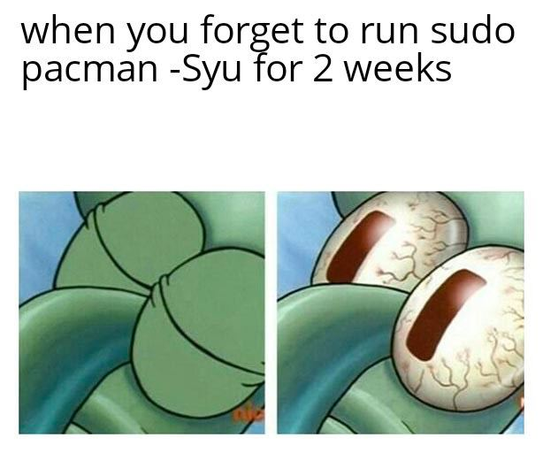
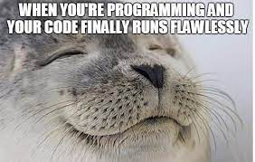
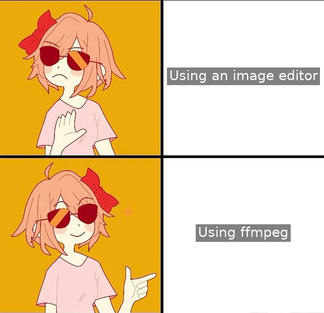
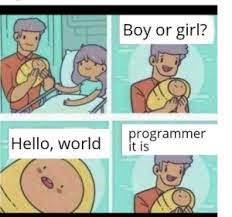
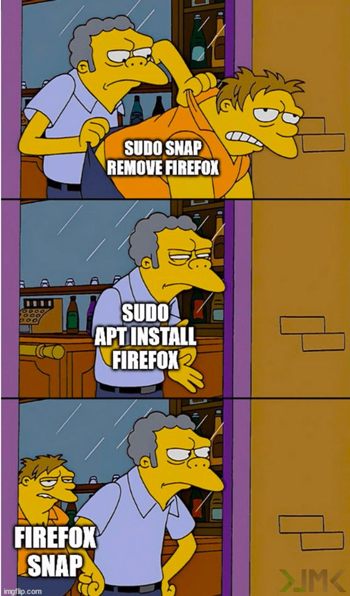

# have-fun-with-memes

# Rules
* Pull request will only be accepted if README.md is accepted
* meme file name should not contain spaces (replace spaces with "_" eg: "hello there" -> "hello_there")
* \[alt text](image_url) syntax (Add your name at alt text)
* happy_memeing ;)

 

